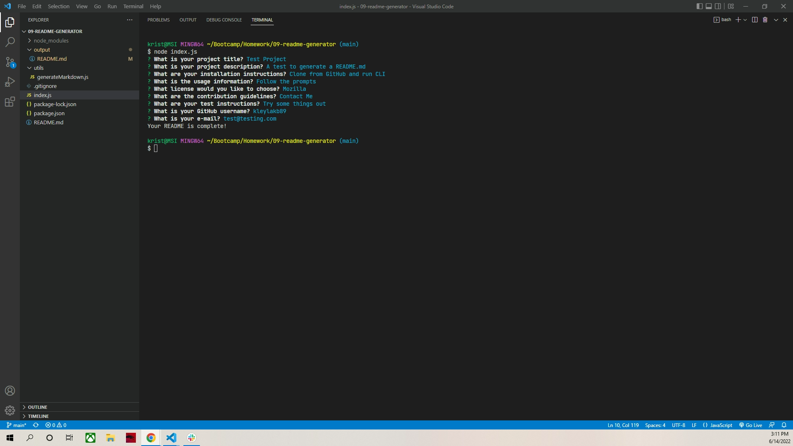

# README Generator

## Table of Contents

1. [Description](#description)
2. [Usage](#usage)
3. [Visuals](#visuals)
4. [Resources](#resources)

## Description

A JavaScript program that utilizes node.js and inquirer to prompt for questions, then take the answers and format them into a quality README.md file.

Features include:

- Utilizing the file system to write a README.md that includes: Title, Description, Table of Contents, Installation, Usage, License, Contributing, Tests, and Questions
- Questions that can be answered by user input or list. These answers become the content of the README.
- A license badge displayed based on the license chosen.
- Links to the user's GitHub and email address.
- A Table of Contents that navigates to the corresponding sections of the README.

## Usage

Upon entering 'node index.js', the user will be prompted to answer questions about their project. Blank answers will not be accepted. A list of license options can be navigated through to select one of the licenses or no license. If a license is chosen, a badge and link to the license will be added to the README, otherwise it will not be included. After user answers all the questions, a README.md will be created in the output directory with their information included.

## Visuals

An example of the CLI after running the program.

## Resources

- [Repository](https://github.com/kleylakb89/09-readme-generator)
- [Video Walkthrough](https://drive.google.com/file/d/1NKofr6N6cN_Ea6MPO8cHxab6Yo1O6lr2/view)
- [Generated README]()